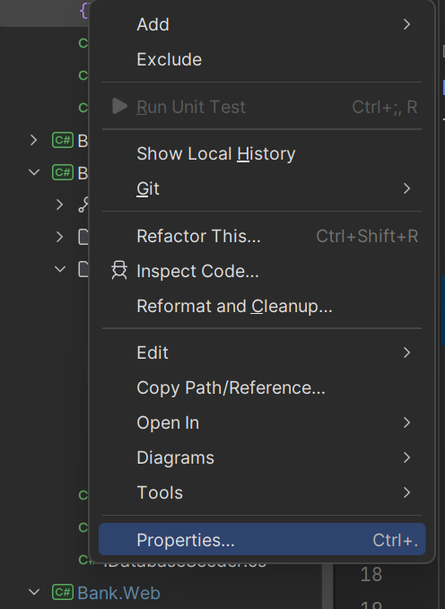
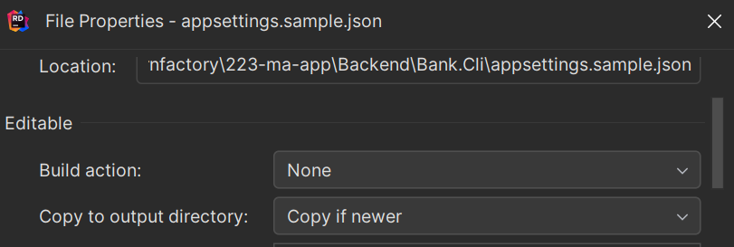

# Projekt Setup

Zum start mit dem Modul 223, müssen wir unsere Geräte bereit machen für die Entwicklung von Fullstack applikationen. Fullstack, heisst von der DB bis zum Frontend. Und mit der Datenbank fangen wir an.

### Datenbank Setup

Falls Sie bereits SQLExpress oder MariaDB lokal installiert haben, brauchen Sie das Docker Setup nicht.

### Via Docker

Teilaufgabe 1: Installation Docker

Installieren Sie Docker. Gehen Sie dabei professionell vor und informieren Sie sich zuerst über das Produkt und die Installation. Sie können dabei das Web oder auch YouTube verwenden. Gehen Sie bei der Installation sorgfältig vor und kontrollieren Sie Ihre Einstellungen jeweils. [docker](https://docs.docker.com/get-docker/)

Erstellen sie ein .env file, sie können auch das env.sample file kopieren und anpassen.

Starten Sie den Container mit der MariaDB. 

### Dev Setup

Holen sie sich das Repo runter, mit dem FE und BE Code.
Dieses finden sie [hier](https://github.com/GF3R/223-ma-app)

Falls noch nicht installiert, laden Sie sich folgende Tools herunter:

Für die Frontendentwicklung:
- [Visual Studio Code](https://code.visualstudio.com/)
- [Node.js](https://nodejs.org/en/)
- [NPM](https://www.npmjs.com/)
Optional können Sie sich auch [NVM](https://www.freecodecamp.org/news/node-version-manager-nvm-install-guide/) installieren, um zwischen verschiedenen Node Versionen zu wechseln.

Für die Backendentwicklung:
- [Visual Studio](https://visualstudio.microsoft.com/de/vs/)
oder auch 
- [Rider](https://www.jetbrains.com/rider/)
für die abenteuerlustigen unter uns:
- [VS Code](https://code.visualstudio.com/)

Sonstiges:

- [Git](https://git-scm.com/)

#### appsettings.json

Erstellen Sie ein Appsettings.json, sodass sie die Werte aus ihrem .env file verwenden. 

Wenn all dies gemacht ist, sollten sie das Frontend und Backend starten können.
Dieses finden sie im Repo unter `frontend` und `backend`.

Testen Sie das und loggen Sie sich ein.

Wenn das geklappt hat, machen Sie das gleiche mit dem `cli` Projekt.
Falls es nicht startet, könnte es daran liegen, dass das Appsettings.json nicht sauber kopiert wird im Build Prozess. 

Stellen Sie sicher, dass bei ihrem Appsettings.json die Properties auf `Copy if newer` oder `Copy always` stehen:

