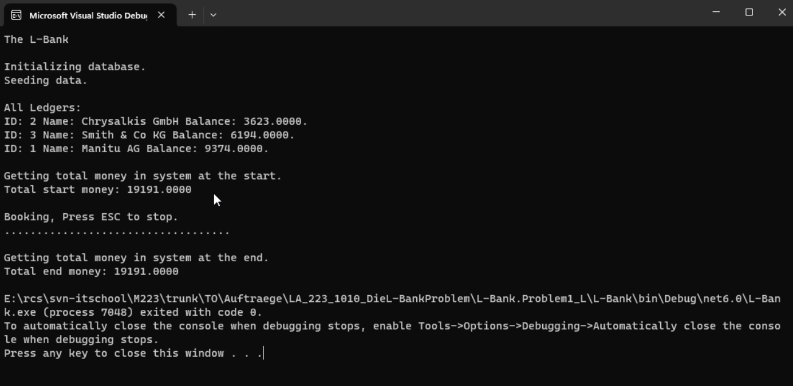

# Die L-Bank: Das Problem

## Ausgangslage
Sie haben das Erstellte Programm der L-Bank zum Laufen gebracht und
analysiert. In diesem Programm geht es um die Multiuserprobleme.

### Teilaufgabe 1: Buchungen
Um den Betrieb zu simulieren, soll das Banking-Programm so erweitert werden,
dass es den Betrieb simuliert und zufällige Buchungen vornimmt.
Erweitern Sie das Programm so in "Simple.cs" an der Stelle wo
```csharp	
////////////////////
// Your Code Here
////////////////////
```

steht, dass folgender Ablauf implementiert wird:
1. Ausgabe von «Booking, press ESC to stop.».
2. Um ein zufälliges Konto auszusuchen, sollte «allLedgers» in ein Array
umgewandelt werden.
3. Solange nicht «ESC» gedrückt wird1:
    - «from» soll ein zufälliges Konto sein2.
    - «to» soll ein zufälliges Konto sein.
    - «amount» soll ein zufälliger Betrag zwischen 1 und 100 sein.
    - Ledgers.Book(amount, from, to);
    - Console.Write(".");
4. Schreiben Sie einen Zeilenumbruch auf die Konsole.

Der Ablauf sollte so aussehen:



Lassen Sie das Programm laufen. Verändert sich sie Summe des Geldes im
System? Sollte sie sich verändern?

### Teilaufgabe 2: Das erste Problem
Um mehrere User (multiuser) zu simulieren, starten Sie das Programm
mehrfach (mindestens drei Mal):
Klicken Sie mit der rechten Maustaste auf das Projekt und wählen Sie «Debug»,
«Start Without Debugging».
Je nach IDE müssen Sie zudem die Build Config anpassen und mehrere parallele Instanzen erlauben, via der checkbox "Allow multiple instances".


Verändert sich sie Summe des Geldes im System? Sollte sie sich verändern?

Warum verändert sich die Summe des Geldes? Nehmen Sie an, Sie haben drei
Konti («Ledger a» mit 1000, «Ledger b» mit 1000 und «Ledger c» mit 0) und
lassen das Programm zweimal laufen («Instanz 1» und «Instanz 2»).

Vorüberlegung: Wenn das eine Programm «Instanz a» die Daten in der
Datenbank ändert, ändern sie sich dann in den Ledger-Objekten des zweiten
gestarteten Programmes «Instanz b»?

Füllen Sie die Daten zu folgendem Ablauf aus (exakt so, wie es das Programm
machen würde):

Start:
- Datenbank, Geld auf Ledger a: 1000
- Datenbank, Geld auf Ledger b: 1000
- Datenbank, Geld auf Ledger c: 0
- Datenbank, Geld Total:


Schritt 1: Instanz a und Instanz b lesen die Werte aus der Datenbank
- Programm Instanz a, «balance» von Ledger a: 1000
- Programm Instanz a, «balance» von Ledger b: 1000
- Programm Instanz a, «balance» von Ledger c: 0
- Programm Instanz b, «balance» von Ledger a: 1000
- Programm Instanz b, «balance» von Ledger b: 1000
- Programm Instanz b, «balance» von Ledger c: 0
- Datenbank, Geld auf Ledger a: 1000
- Datenbank, Geld auf Ledger b: 1000
- Datenbank, Geld auf Ledger c: 0
- Datenbank, Geld Total:


Schritt 2: Instanz a bucht 10 von Ledger a auf Ledger b (und speichert a und b)
- Programm Instanz a, «balance» von Ledger a:
- Programm Instanz a, «balance» von Ledger b:
- Programm Instanz a, «balance» von Ledger c:
- (HERE LIE DRAGONS, denken Sie gut nach)
- Programm Instanz b, «balance» von Ledger a:
- Programm Instanz b, «balance» von Ledger b:
- Programm Instanz b, «balance» von Ledger c:
- Datenbank, Geld auf Ledger a:
- Datenbank, Geld auf Ledger b:
- Datenbank, Geld auf Ledger c:
- Datenbank, Geld Total:


Schritt 3: Instanz b bucht 20 von Ledger a auf Ledger c (und speichert a und c)
- Programm Instanz a, «balance» von Ledger a:
- Programm Instanz a, «balance» von Ledger b:
- Programm Instanz a, «balance» von Ledger c:
- Programm Instanz b, «balance» von Ledger a:
- Programm Instanz b, «balance» von Ledger b:
- Programm Instanz b, «balance» von Ledger c:
- Datenbank, Geld auf Ledger a:
- Datenbank, Geld auf Ledger b:
- Datenbank, Geld auf Ledger c:
- Datenbank, Geld Total (💣):

Wie könnte dieses Problem behoben werden?

### Teilaufgabe 3: Beheben des Problems

Ergänzen Sie LedgerRepository.cs um eine Methode «public void LoadBalance()», welche mit
dem SQL-Befehl «SELECT balance FROM ledgers WHERE id=@Id» die Balance
aus der Datenbank liest. Schauen Sie dabei bei LedgerRepository.GetTotalMoney() nach,
wie man einen Wert aus der Datenbank ausliest.
Ergänzen Sie LedgerRepository.Book(…) wie folgt.
    
```csharp
public void Book(decimal amount, Ledger from, Ledger to)
{
    this.LoadBalance(from);
    from.Balance -= amount;
    from.Save();
    // Complicate calculations
    Thread.Sleep(250);
    this.LoadBalance(to);
    to.Balance += amount;
    to.Save();
}
```	

Das sollte das erkannte Problem beheben?

Starten Sie das Programm mehrfach und prüfen Sie, ob nun kein Geld mehr
verschwindet oder erzeugt wird.

**Houston, we have a problem…**