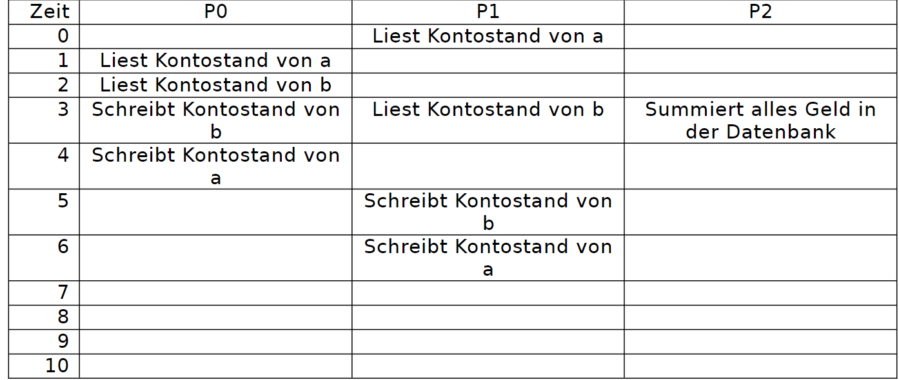
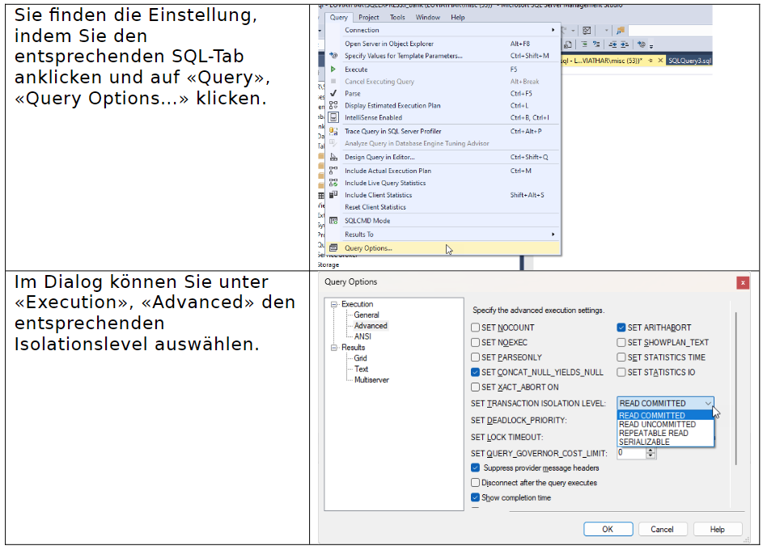

# Transaktionen

Die Relevanz von Transaktionen wurde gezeigt. Sie haben einen lauffähigen MsSQL-Server auf Ihrem Rechner und die Beispieldatenbank ist vorhanden.
Wenn Sie die Beispieldatenbank noch nicht erstellt haben, können Sie
folgendermassen vorgehen:

Kopieren Sie folgendes SQL-Statement in das SQL Server Management Studio und führen Sie es aus:

```sql
USE [master]
GO

CREATE DATABASE [l_bank]
GO

USE [l_bank]
GO

SET ANSI_NULLS ON
GO

SET QUOTED_IDENTIFIER ON
GO

CREATE TABLE [dbo].[ledgers](
	[id] [int] IDENTITY(1,1) NOT NULL,
	[name] [nvarchar](50) NOT NULL,
	[balance] [money] NOT NULL,
PRIMARY KEY CLUSTERED 
(
	[id] ASC
)WITH (PAD_INDEX = OFF, STATISTICS_NORECOMPUTE = OFF, IGNORE_DUP_KEY = OFF, ALLOW_ROW_LOCKS = ON, ALLOW_PAGE_LOCKS = ON, OPTIMIZE_FOR_SEQUENTIAL_KEY = OFF) ON [PRIMARY]
) ON [PRIMARY]
GO

SET IDENTITY_INSERT [dbo].[ledgers] ON 
GO
INSERT [dbo].[ledgers] ([id], [name], [balance]) VALUES (16, N'Manitu AG', 100.0000)
GO
INSERT [dbo].[ledgers] ([id], [name], [balance]) VALUES (17, N'Chrysalkis GmbH', 200.0000)
GO
INSERT [dbo].[ledgers] ([id], [name], [balance]) VALUES (18, N'Smith & Co KG', 300.0000)
GO
SET IDENTITY_INSERT [dbo].[ledgers] OFF
GO

```

falls sie MariaDB verwenden, können sie folgendes SQL-Statement verwenden:

```sql
-- (Optional) Drop the database if it already exists
DROP DATABASE IF EXISTS l_bank;

-- Create and select the database
CREATE DATABASE l_bank;
USE l_bank;

-- Create the table
CREATE TABLE ledgers (
    id INT NOT NULL AUTO_INCREMENT,
    name VARCHAR(50) NOT NULL,
    balance DECIMAL(19,4) NOT NULL,
    PRIMARY KEY (id)
);

-- Insert data
INSERT INTO ledgers (id, name, balance) VALUES
    (16, 'Manitu AG', 100.0000),
    (17, 'Chrysalkis GmbH', 200.0000),
    (18, 'Smith & Co KG', 300.0000);

```

## Aufgabenstellung
In dieser Aufgabe werden Transaktionen theoretisch und praktisch erkundet.
### Teilaufgabe 1 Theoretische Analyse
In folgender Tabelle läuft die Zeit von oben nach unten. P0 bis P2 sind unterschiedliche Prozesse (Programme, User, …).
a, b, c sind unterschiedliche Datensätze.


Gehen Sie davon aus, dass wenn ein Prozess einen Datensatz (a, b oder c) liest
und danach schreibt, er damit arbeitet und die Datenbank zu diesem Zeitpunkt
inkonsistent ist.
Versuchen Sie zu identifizieren, wo folgende Probleme auftreten können:
- Dirty Read
- Non-repeatable read
- Phantom Read
- Sich gegenseitig überschreibende Daten

Welchen Isolationslevel brauchen Sie, um diese Probleme zu verhindern?

### Teilaufgabe 2: Theoretische Analyse L-Bank

Nehmen Sie folgenden Ablauf für die L-Bank:



Versuchen Sie zu identifizieren, wo folgende Probleme auftreten können:
- Dirty Read
- Non-repeatable read

Da keine Datensätze erstellt oder gelöscht werden, gibt es keine Phantom
Reads Welchen Isolationslevel brauchen Sie, um diese Probleme zu verhindern?

P0 und P1:

P2:

### Teilaufgabe 3: Praktische Analyse L-Bank

Hier simulieren wir diesen Ablauf mit und ohne Transaktionen «von Hand».
Öffnen Sie das «Microsoft SQL Server Management Studio».

Bereiten Sie folgende Dinge vor:

- ID des ersten Datensatz in der Tabelle ledgers (a):
- ID des zweiten Datensatz in der Tabelle ledgers (b):
- SQL-Befehl um alles Geld zu summieren:
- SQL-Befehl um den Kontostand von a auszulesen:
- SQL-Befehl um den Kontostand von b auszulesen:
- SQL-Befehl um den Kontostand von a neu zu schreiben:
- SQL-Befehl um den Kontostand von b neu zu schreiben:
- Summe des Geldes zu Beginn:
- Öffnen Sie drei Fenster für P0, P1 und P3:

Schreiben Sie statt den Anweisungen nun die SQL-Befehle in die Tabelle.
- P0 soll 20 von a zu b buchen.
- P1 soll 30 von b zu a buchen.


| Zeit | P0 | P1 | P2 |
| --- | --- | --- | --- |
| 0 | | | |
| 1 | | | |
| 2 | | | |
| 3 | | | |
| 4 | | | |
| 5 | | | |
| 6 | | | |

Gehen Sie nun folgendermassen vor:

Löschen Sie vor jedem neuen Befehl immer wieder alle vorherigen Befehle,
sonst werden sie mehrfach ausgeführt.

**Zeit 0:**
Öffnen Sie den zweiten SQL-Tab, fragen Sie den Kontostand von a ab und schreiben Sie ihn auf:
```sql
SELECT balance FROM ledgers WHERE id = 16
```

**Zeit 1:**
Öffnen Sie den dritten SQL-Tab, fragen Sie den Kontostand von a ab und schreiben Sie ihn auf

**Zeit 2:**
Öffnen Sie den ersten SQL-Tab, fragen Sie den Kontostand von b ab und schreiben Sie ihn auf

**Zeit 3:**
P0 soll 20 von a zu b buchen.

Rechnen Sie hier den neuen Kontostand von b aus (den bei Zeit 2 + 20):

Öffnen Sie den ersten SQL-Tab und schreiben Sie dieses Resultat in das Feld balance von b.

Öffnen Sie den zweiten SQL-Tab, fragen Sie den Kontostand von b ab und schreiben Sie ihn auf:

Öffnen Sie das dritte Fenster und fragen Sie die Summe allen Geldes in Ledgers ab:

Fällt ihnen etwas auf?

**Zeit 4:**
P0 soll 20 von a zu b buchen.

Rechnen Sie hier den neuen Kontostand von a aus (den bei Zeit 1 - 20):

Öffnen Sie den ersten SQL-Tab und schreiben Sie dieses Resultat in das Feldbalance von a.

**Zeit 5:**
P1 soll 30 von b zu a buchen.

Rechnen Sie hier den neuen Kontostand von b aus (den bei Zeit 3 für P1 - 30):

Öffnen Sie den zweiten SQL-Tab und schreiben Sie dieses Resultat in das Feld balance von b.

**Zeit 6:**

Ja, Sie müssen den Befehl nochmals eingeben, sonst weiss die Datenbank nicht, dass dieser Prozess an diesen Daten interessiert ist.

P1 soll 30 von b zu a buchen.

Rechnen Sie hier den neuen Kontostand von a aus (den bei Zeit 0 + 30):

Öffnen Sie den zweiten SQL-Tab und schreiben Sie dieses Resultat in das Feld
balance von a.

Und zum Spass: Wie viel Geld haben wir nun in der Datenbank?
Fällt ihnen was auf?

### Teilaufgabe 4: Praktische Analyse L-Bank mit Transaktionen

Stellen Sie für die ersten beiden SQL-Tabs die Isolation «Serializeable» ein und für die dritte Tab «Read Committed» (Lösung aus Aufgabe 2).



Starten Sie in jedem der drei Tabs eine Transaktion, indem Sie «BEGIN TRANSACTION;» eingeben und auf «Execute» klicken.

Falls Sie MariaDb verwenden alutet der Befehl `START TRANSACTION;`

Führen Sie die Befehle aus der Tabelle  erneut aus.

Was fällt Ihnen auf?