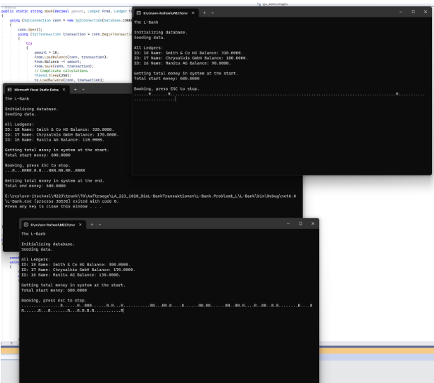

# Transaktionen Teil 2

## Ausgangslage
Sie haben das Programm für die L-Bank, das leider Geld erzeugt und vernichtet.
Sie haben auch das Theoretische Wissen über Transaktionen und den Ablauf schon durchgespielt.

## Aufgabenstellung
Fixen Sie die L-Bank.

### Teilaufgabe 1: Transaktionen
Ersetzen Sie die Funktionen, Book, GetAllLedgers und GetTotalMoney  im LedgerRepository durch den Code unterhalb. 
```csharp


    public string Book(decimal amount, Ledger from, Ledger to)
    {
        using (MySqlConnection conn = new MySqlConnection(this.databaseSettings.ConnectionString))
        {
            conn.Open();
            using (MySqlTransaction transaction = conn.BeginTransaction(IsolationLevel.Serializable))
            {
                try
                {
                    amount = 10;
                    from.Balance = this.GetBalance(from.Id, conn, transaction) ?? throw new ArgumentNullException();
                    from.Balance -= amount;
                    this.Update(from, conn, transaction);
                   // Complicate calculations
                    Thread.Sleep(250);
                    to.Balance = this.GetBalance(to.Id, conn, transaction) ?? throw new ArgumentNullException();
                    to.Balance += amount;
                    this.Update(to, conn, transaction);

                    // Console.WriteLine($"Booking {amount} from {from.Name} to {to.Name}");

                    transaction.Commit();
                    return ".";
                }
                catch (Exception ex)
                {
                    //Console.WriteLine("Commit Exception Type: {0}", ex.GetType());
                    //Console.WriteLine("  Message: {0}", ex.Message);

                    // Attempt to roll back the transaction.
                    try
                    {
                        transaction.Rollback();
                        return "R";
                    }
                    catch (Exception ex2)
                    {
                        // Handle any errors that may have occurred on the server that would cause the rollback to fail.
                        //Console.WriteLine("Rollback Exception Type: {0}", ex2.GetType());
                        //Console.WriteLine("  Message: {0}", ex2.Message);
                        return "E";
                    }
                }
            }
        }
    }

    public IEnumerable<Ledger> GetAllLedgers()
    {
        var allLedgers = new HashSet<Ledger>();

        const string query = @$"SELECT id, name, balance FROM {Ledger.CollectionName}";
        using (MySqlConnection conn = new MySqlConnection(this.databaseSettings.ConnectionString))
        {
            conn.Open();
            using (MySqlCommand cmd = new MySqlCommand(query, conn))
            {
                using (SqlDataReader reader = cmd.ExecuteReader())
                {
                    while (reader.Read())
                    {
                        int id = reader.GetInt32(reader.GetOrdinal("id"));
                        string name = reader.GetString(reader.GetOrdinal("name"));
                        decimal balance = reader.GetDecimal(reader.GetOrdinal("balance"));

                        allLedgers.Add(new Ledger()
                        {
                            Balance = balance,
                            Id = id,
                            Name = name
                        });
                    }
                }
            }
        }

        return allLedgers.ToImmutableHashSet<Ledger>();
    }

    public decimal GetTotalMoney()
    {
        const string query = @$"SELECT SUM(balance) AS TotalBalance FROM {Ledger.CollectionName}";
        decimal totalBalance = 0;

        using (MySqlConnection conn = new MySqlConnection(this.databaseSettings.ConnectionString))
        {
            conn.Open();
            using (MySqlTransaction transaction = conn.BeginTransaction(IsolationLevel.ReadCommitted))
            {
                try
                {
                    using (SqlCommand cmd = new SqlCommand(query, conn, transaction))
                    {
                        object result = cmd.ExecuteScalar();
                        if (result != DBNull.Value)
                        {
                            totalBalance = Convert.ToDecimal(result);
                        }
                    }
                }
                catch (Exception ex)
                {
                    Console.WriteLine("Commit Exception Type: {0}", ex.GetType());
                    Console.WriteLine("  Message: {0}", ex.Message);

                    // Attempt to roll back the transaction.
                    try
                    {
                        transaction.Rollback();
                    }
                    catch (Exception ex2)
                    {
                        // Handle any errors that may have occurred on the server that would cause the rollback to fail.
                        Console.WriteLine("Rollback Exception Type: {0}", ex2.GetType());
                        Console.WriteLine("  Message: {0}", ex2.Message);
                    }
                }
            }

            return totalBalance;
        }
    }

```

Passen sie zudem das Interface entsprechend an.

Wenn Sie dies gemacht haben, passen Sie das Programm.CS an, Sodass die Zeile "Simple.Run();" auskommentiert wird und die Zeile "WithTransactions.Run();" einkommentiert wird. Danach sollte es so aussehen: 

```csharp
// Simple.Run(ledgerRepository);

WithTransactions.Run(allLedgers, ledgerRepository);
```

Kommentieren Sie zudem die Zeile 23 im "WithTransactions.cs" ein.

Ergänzen Sie «LedgerRepository.cs» und «Ledger.cs» mit Transaktionen.

Hinweis:
Da die Operationen in «LedgerRepository.cs» in der Transaktion ausgeführt werden sollen, und in C# die Transaktionen in den Connections verortet sind, dürfen Sie in den Methoden keine eigenen Connections öffnen. Übergeben Sie den Methoden die Connection und die Transaktion.

Starten Sie das Programm und vergewissern Sie sich, dass es im Singleusermodus noch läuft.

### Teilaufgabe 2: Ausgabe
Geben Sie bei jeder erfolgreichen Transaktion einen Punkt, für jedes Rollback ein «R» und für jeden Rollbackfehler ein «E» aus. 

Starten Sie das Programm mehrfach.

Die Ausgabe sollte wie folgt aussehen:

