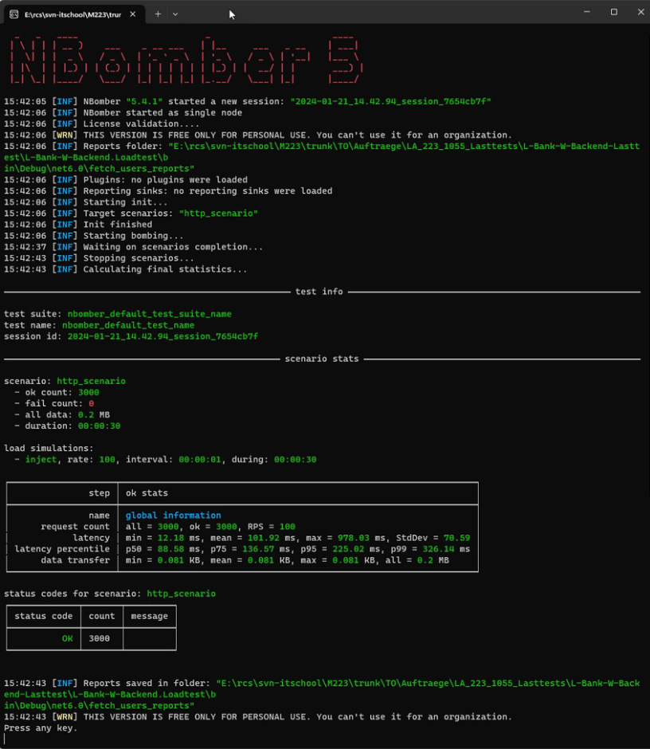

# Lasttests

Um sicherzustellen, dass Ihre Applikation auch unter erhöhter Last richtig funktioniert testen Sie auch diesen Aspekt.

## Aufgabenstellung
Erstellen Sie Last-Tests, die spezifisch auf die Multiuserprobleme testen.

### Teilaufgabe 1: Basis aufbauen

Erstellen Sie in Ihrer Solution ein neues Konsolen-Projekt mit dem Namen «L-Bank.Tests.Loadtest.Cli».

Passen Sie die Main-Methode inklusive der Definition an:

```csharp

using System;

namespace LBank.Tests.Loadtest.Cli
{
    class Program
    {
        static async Task Main(string[] args)
        {
            string jwt = await Login("admin", "adminpass");
            var ledgers = await GetAllLedgers(jwt);
            foreach (var ledger in ledgers)
            {
                Console.WriteLine(ledger.Name);
            }

            Console.WriteLine("Press any key to exit");
            Console.ReadKey();
        }
    }
}

```

Implementieren Sie die beiden Methoden «Login(…)», die einloggt und ein JWT-Token zurückgibt und «GetAllLedgers(…)», die alle Ledgers zurückgibt.
Beide Methoden sollen das API verwenden, und nicht direkt Code aufrufen. Tipp: Sie können sich an «ApiService» im Frontend orientieren, die beide Methoden in ähnlicher Form enthält.

Hinweis: Das Backend muss natürlich laufen, damit es die API-Anfragen beantworten kann.


###Teilaufgabe 2: NBomber

Lesen Sie sich auf https://blog.noser.com/lasttests-mit-nbomber/ und https://nbomber.com/docs/getting-started/overview ein, was NBomber ist und wie es angewendet wird.

Installieren Sie folgende Nuget-Packages in dieses neue Projekt:
- NBomber
- NBomber.Http

Um zu testen, ob NBomber grundsätzlich funktioniert, integrieren Sie den Code aus https://nbomber.com/docs/getting-started/hello_world_tutorial#create-production-ready-http-load-test (Abschnitt «Create production-ready HTTP load test») in den bestehenden Code mit ein.

Machen Sie folgende Anpassungen:
- Die URL sollte https://localhost:7183/api/v1/lbankinfo sein.
- Lassen Sie einen Report erstellen und ergänzen Sie den entsprechenden Codeabschnitt:
```csharp	
NBomberRunner
.RegisterScenarios(scenario)
.WithReportFileName("fetch_users_report")
.WithReportFolder("fetch_users_reports")
.WithReportFormats(ReportFormat.Html)
.Run();
```

- Fügen Sie am Ende «Console.ReadKey();» ein.
Wenn Sie nun das Backend und dieses Programm starten, sollten Sie eine Ausgabe wie Folgt sehen:




Ganz unten sehen Sie einen Abschnitt «Reports saved in …». In diesem Ordner sollten Sie eine HTML-Datei mit allen Resultaten finden.

Finden Sie heraus, wie viele Anfragen gestartet wurden und wie lange sie im Durchschnitt gedauert haben.

### Teilaufgabe 3: Überprüfen des Geldbetrages

Fragen Sie zu Beginn und am Ende über das API alle Ledgers ab. Vergleichen
Sie den Geldbetrag am Ende und geben Sie auf der Konsole aus, ob sich der
Geldbetrag geändert hat. Im Idealfall sollte es etwa so aussehen:


### Teilaufgabe 4: Testen des Booking APIs
Schreiben Sie das Beispiel so um, dass Sie das Booking API stresstesten können. Studieren Sie den Report. Was bedeuten die «Conflict» Rückmeldungen im Szenario?

Hinweise:
- Sie können Sich am Frontend orientieren, dass das Backend aufruft.
- Der Aufruf ist wie folgt:
```csharp
var request =
Http.CreateRequest("POST", "http://localhost:5000/api/v1/bookings")
.WithHeader("Accept", "application/json")
.WithHeader("Authorization", $"Bearer {jwt}")
.WithBody(jsonContent);
var response = await Http.Send(httpClient, request);
```
